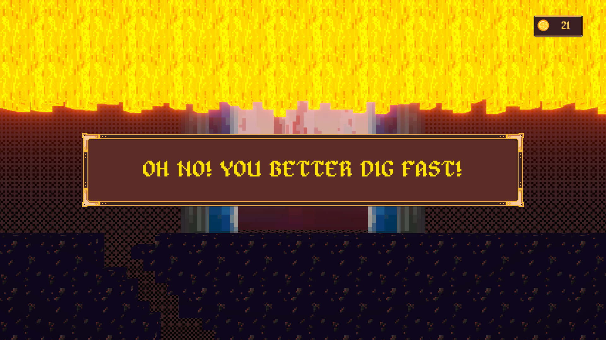

# Try our game and [let us know what you think on LDJam!](https://ldjam.com/events/ludum-dare/57/d-u-g-doug-under-da-ground/) 

# D.U.G.: Doug Underda Ground 
## [(Ludum Dare 57)](https://ldjam.com/events/ludum-dare/57/d-u-g-doug-under-da-ground/) 

Doug Douglas is a free-spirited, free-willed, freelance miner. As a dwarf, he’s seen his fair share of underground caverns and crevices, and he’s not afraid to go as deep and the job requires. He has an eye for treasure, and a knack for bargaining, so any spoils he finds become weapons in his arsenal. If you need some digging done, Doug “The Digman” Douglas is destined to be the dwarven delver for you! 

D.U.G. is an action game about digging and finding gold. Gather skills to dig faster and harder and make as much gold as you can! Don’t take too long and beware too much power! Who knows what will happen? 😉 

# Controls

## W/A/S/D to move, E to open shop 

## Space to jump 

## Left click to destroy rocks 

